# Canonical Data Model — ERD

Fully normalized Silver Canonical layer with entity, relationship, and history tables.

## Entity Relationship Diagram

```mermaid
erDiagram
    CLIENT {
        string client_id PK
        string client_name
        string client_type
        string client_segment
        string service_model
        string risk_tolerance
        string investment_experience
        string state
        string city
        string zip
        date relationship_start_date
        boolean is_active
        string _source_system
        timestamp _loaded_at
    }

    ADVISOR {
        string advisor_id PK
        string advisor_name
        string role
        string crd_number
        string rep_code
        string branch_name
        boolean is_active
        date hire_date
        string _source_system
    }

    TEAM {
        string team_id PK
        string team_name
        string region
        string branch_name
        boolean is_active
        string _source_system
    }

    ACCOUNT {
        string account_id PK
        string account_number
        string account_name
        string account_type
        string registration_type
        string custodian_code
        string fee_schedule
        number management_fee_rate
        boolean is_discretionary
        string status
        date inception_date
        string _source_system
    }

    SECURITY {
        string security_id PK
        string ticker
        string cusip
        string security_name
        string asset_class
        string sector
        string security_type
        boolean is_active
    }

    BENCHMARK {
        string benchmark_id PK
        string benchmark_name
        string benchmark_ticker
        string benchmark_type
        string asset_class
        boolean is_active
    }

    MODEL_PORTFOLIO {
        string model_id PK
        string model_name
        string risk_profile
        number equity_target_pct
        number fixed_income_target_pct
        number alternative_target_pct
        number cash_target_pct
        boolean is_active
    }

    POSITION {
        string position_id PK
        string account_id FK
        string security_id FK
        date as_of_date
        number quantity
        number price
        number market_value
        number cost_basis
        number unrealized_gain_loss
        number weight_pct
        string cost_basis_method
    }

    TRANSACTION {
        string transaction_id PK
        string account_id FK
        string security_id FK
        date trade_date
        date settle_date
        string transaction_type
        number quantity
        number price
        number gross_amount
        number net_amount
        number commission
        number fees
    }

    FEE {
        string fee_id PK
        string account_id FK
        date billing_period_start
        date billing_period_end
        string fee_type
        number billable_aum
        number fee_rate
        number fee_amount
        string fee_status
    }

    RETURN_RECORD {
        string return_id PK
        string account_id FK
        string benchmark_id FK
        date as_of_date
        number mtd_return
        number qtd_return
        number ytd_return
        number one_year_return
        number mtd_excess_return
        number ytd_excess_return
        string return_method
    }

    OPPORTUNITY {
        string opportunity_id PK
        string client_id FK
        string advisor_id FK
        string opportunity_name
        string stage
        string opportunity_type
        number amount
        date close_date
        number probability
        string lead_source
    }

    FINANCIAL_GOAL {
        string goal_id PK
        string client_id FK
        string goal_name
        string goal_type
        number target_amount
        number current_amount
        date target_date
        string status
    }

    CLIENT_ADVISOR {
        string client_advisor_id PK
        string client_id FK
        string advisor_id FK
        string relationship_type
        boolean is_primary
        date effective_from
        date effective_to
        boolean is_current
    }

    CLIENT_ACCOUNT {
        string client_account_id PK
        string client_id FK
        string account_id FK
        string ownership_type
        number ownership_pct
        date effective_from
        date effective_to
        boolean is_current
    }

    ADVISOR_TEAM {
        string advisor_team_id PK
        string advisor_id FK
        string team_id FK
        string role_in_team
        date effective_from
        date effective_to
        boolean is_current
    }

    ACCOUNT_MODEL {
        string account_model_id PK
        string account_id FK
        string model_id FK
        date effective_from
        date effective_to
        boolean is_current
    }

    MODEL_BENCHMARK {
        string model_benchmark_id PK
        string model_id FK
        string benchmark_id FK
        date effective_from
        date effective_to
        boolean is_current
    }

    CLIENT_HISTORY {
        string client_history_id PK
        string client_id FK
        string client_segment
        string service_model
        string risk_tolerance
        string state
        boolean is_active
        number version_number
        timestamp valid_from
        timestamp valid_to
        boolean is_current
        boolean is_deleted
    }

    ADVISOR_HISTORY {
        string advisor_history_id PK
        string advisor_id FK
        string role
        string rep_code
        string branch_name
        boolean is_active
        number version_number
        timestamp valid_from
        timestamp valid_to
        boolean is_current
        boolean is_deleted
    }

    ACCOUNT_HISTORY {
        string account_history_id PK
        string account_id FK
        number market_value
        number cash_balance
        string status
        string fee_schedule
        number management_fee_rate
        string model_id
        number version_number
        timestamp valid_from
        timestamp valid_to
        boolean is_current
        boolean is_deleted
    }

    POSITION_HISTORY {
        string position_history_id PK
        string account_id FK
        string security_id FK
        date as_of_date
        number quantity
        number market_value
        number cost_basis
        number unrealized_gain_loss
        number version_number
        timestamp valid_from
        timestamp valid_to
        boolean is_current
    }

    CLIENT ||--o{ CLIENT_ADVISOR : "managed by"
    ADVISOR ||--o{ CLIENT_ADVISOR : "manages"
    ADVISOR ||--o{ ADVISOR_TEAM : "member of"
    TEAM ||--o{ ADVISOR_TEAM : "contains"
    CLIENT ||--o{ CLIENT_ACCOUNT : "owns"
    ACCOUNT ||--o{ CLIENT_ACCOUNT : "owned by"
    ACCOUNT ||--o{ ACCOUNT_MODEL : "follows"
    MODEL_PORTFOLIO ||--o{ ACCOUNT_MODEL : "assigned to"
    MODEL_PORTFOLIO ||--o{ MODEL_BENCHMARK : "measured by"
    BENCHMARK ||--o{ MODEL_BENCHMARK : "measures"
    ACCOUNT ||--o{ POSITION : "holds"
    SECURITY ||--o{ POSITION : "held as"
    ACCOUNT ||--o{ TRANSACTION : "transacts"
    SECURITY ||--o{ TRANSACTION : "traded"
    ACCOUNT ||--o{ FEE : "charged"
    ACCOUNT ||--o{ RETURN_RECORD : "performs"
    BENCHMARK ||--o{ RETURN_RECORD : "compared to"
    CLIENT ||--o{ OPPORTUNITY : "has"
    ADVISOR ||--o{ OPPORTUNITY : "works"
    CLIENT ||--o{ FINANCIAL_GOAL : "pursues"
    CLIENT ||--o{ CLIENT_HISTORY : "tracked by"
    ADVISOR ||--o{ ADVISOR_HISTORY : "tracked by"
    ACCOUNT ||--o{ ACCOUNT_HISTORY : "tracked by"
    ACCOUNT ||--o{ POSITION_HISTORY : "tracked by"
    SECURITY ||--o{ POSITION_HISTORY : "tracked in"
```

## Table Classification

### Entity Tables (current state, domain-named)

| Table | Domain | Description | Natural Key |
|-------|--------|-------------|-------------|
| `CLIENT` | People | Household or individual relationship | `client_id` |
| `ADVISOR` | People | Financial advisor with CRD registration | `advisor_id` |
| `TEAM` | People | Organizational grouping of advisors | `team_id` |
| `ACCOUNT` | Accounts | Financial/investment account at a custodian | `account_id` |
| `SECURITY` | Holdings | Tradeable instrument (stock, ETF, bond) | `security_id` |
| `BENCHMARK` | Performance | Index or blended benchmark | `benchmark_id` |
| `MODEL_PORTFOLIO` | Performance | Target allocation strategy | `model_id` |
| `POSITION` | Holdings | Security held in an account (point-in-time) | `position_id` |
| `TRANSACTION` | Activity | Trade, dividend, fee, or transfer event | `transaction_id` |
| `FEE` | Activity | Quarterly advisory fee record | `fee_id` |
| `RETURN_RECORD` | Performance | Monthly portfolio return vs benchmark | `return_id` |
| `OPPORTUNITY` | Activity | Sales pipeline item | `opportunity_id` |
| `FINANCIAL_GOAL` | Activity | Client financial objective | `goal_id` |

### Relationship Tables (junction/bridge, temporal)

| Table | Relates | Cardinality | Why temporal |
|-------|---------|-------------|--------------|
| `CLIENT_ADVISOR` | Client <-> Advisor | M:N | Clients can change advisors over time |
| `CLIENT_ACCOUNT` | Client <-> Account | M:N | Joint accounts have multiple owners |
| `ADVISOR_TEAM` | Advisor <-> Team | M:N | Advisors can move between teams |
| `ACCOUNT_MODEL` | Account <-> Model Portfolio | N:1 | Accounts can change models |
| `MODEL_BENCHMARK` | Model <-> Benchmark | N:1 | Benchmark assignments can change |

All relationship tables include `effective_from`, `effective_to`, and `is_current` for temporal tracking.

### History Tables (SCD Type 2)

| Table | Tracks | Key Attributes Tracked |
|-------|--------|----------------------|
| `CLIENT_HISTORY` | Client changes | segment, service_model, risk_tolerance, state, is_active |
| `ADVISOR_HISTORY` | Advisor changes | role, rep_code, branch_name, is_active |
| `ACCOUNT_HISTORY` | Account changes | market_value, cash_balance, status, fee_schedule, model_id |
| `POSITION_HISTORY` | Position changes | quantity, market_value, cost_basis, unrealized_gain_loss |

All history tables include `version_number`, `valid_from`, `valid_to`, `is_current`, and `is_deleted`.

## Naming Convention

| Table Type | Pattern | Example |
|-----------|---------|---------|
| Entity | `{DOMAIN_NOUN}` | `CLIENT`, `ACCOUNT`, `SECURITY` |
| Relationship | `{ENTITY_A}_{ENTITY_B}` | `CLIENT_ADVISOR`, `ACCOUNT_MODEL` |
| History | `{ENTITY}_HISTORY` | `CLIENT_HISTORY`, `ACCOUNT_HISTORY` |
| Activity/Event | `{DOMAIN_NOUN}` | `TRANSACTION`, `FEE`, `RETURN_RECORD` |

## Model Mapping

| Canonical Table | dbt Model | Layer |
|----------------|-----------|-------|
| CLIENT | `slv_client` | silver/canonical |
| ADVISOR | `slv_advisor` | silver/canonical |
| ACCOUNT | `slv_account` | silver/canonical |
| SECURITY | `slv_security` | silver/canonical |
| POSITION | `slv_position` | silver/canonical |
| FEE | `slv_fee` | silver/canonical |
| CLIENT_ADVISOR | `slv_client_advisor` | silver/canonical |
| CLIENT_ACCOUNT | `slv_client_account` | silver/canonical |
| ADVISOR_TEAM | `slv_advisor_team` | silver/canonical |
| ACCOUNT_MODEL | `slv_account_model` | silver/canonical |
| CLIENT_HISTORY | `slv_client_history` | silver/canonical |
| ADVISOR_HISTORY | `slv_advisor_history` | silver/canonical |
| ACCOUNT_HISTORY | `slv_account_history` | silver/canonical |
| POSITION_HISTORY | `slv_position_history` | silver/canonical |
| TRANSACTION | `slv_transaction` | silver/canonical |
| RETURN_RECORD | `slv_return_record` | silver/canonical |
| OPPORTUNITY | `slv_opportunity` | silver/canonical |
| FINANCIAL_GOAL | `slv_financial_goal` | silver/canonical |
| BENCHMARK | `slv_benchmark` | silver/canonical |
| MODEL_PORTFOLIO | `slv_model_portfolio` | silver/canonical |
| MODEL_BENCHMARK | `slv_model_benchmark` | silver/canonical |
