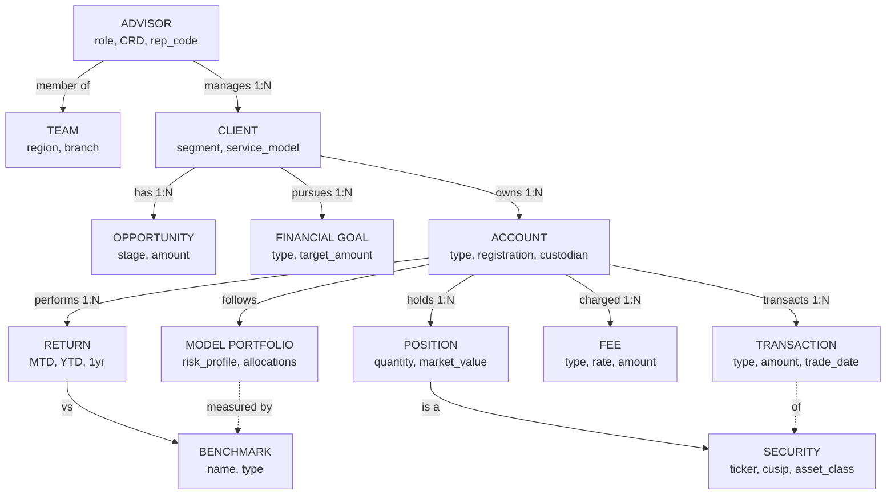

# RIA Wealth Management Ontology

Business entity relationships for the CoWork_WM_RIA_Demo platform.

## Entity Relationship Diagram



## Entity Definitions

### People

| Entity | Description | Natural Key | Source System |
|--------|-------------|-------------|--------------|
| **CLIENT** | A household, individual, or business relationship with the RIA | `account_id` | Salesforce FSC |
| **ADVISOR** | A financial advisor with CRD registration and rep code | `advisor_id` | Salesforce FSC |
| **TEAM** | An organizational grouping of advisors by region and branch | `team_id` | Salesforce FSC |

### Accounts

| Entity | Description | Natural Key | Source System |
|--------|-------------|-------------|--------------|
| **ACCOUNT** | A financial account (IRA, brokerage, trust) held at a custodian | `financial_account_id` / `account_number` | FSC + Performance + Custodian |
| **MODEL PORTFOLIO** | A target allocation strategy (e.g. Moderate Growth, Conservative Income) | `model_id` | Performance System |

### Holdings

| Entity | Description | Natural Key | Source System |
|--------|-------------|-------------|--------------|
| **POSITION** | A security holding within an account at a point in time | `holding_id` | Performance + Custodian |
| **SECURITY** | A tradeable instrument (stock, ETF, bond, fund) | `ticker` / `cusip` | Performance System |

### Activity

| Entity | Description | Natural Key | Source System |
|--------|-------------|-------------|--------------|
| **TRANSACTION** | A trade, dividend, fee debit, or transfer event | `transaction_id` | Custodian |
| **FEE** | A quarterly advisory fee calculation and debit | `fee_id` | Custodian |
| **OPPORTUNITY** | A pipeline item — new assets, rollover, or referral | `opportunity_id` | Salesforce FSC |
| **FINANCIAL GOAL** | A client's target — retirement, education, wealth transfer | `goal_id` | Salesforce FSC |

### Performance

| Entity | Description | Natural Key | Source System |
|--------|-------------|-------------|--------------|
| **RETURN** | Monthly portfolio TWR/IRR returns with benchmark comparison | `return_id` | Performance System |
| **BENCHMARK** | An index, blended, or custom benchmark for comparison | `benchmark_id` | Performance System |

## Relationship Cardinalities

| From | Relationship | To | Cardinality |
|------|-------------|-----|-------------|
| ADVISOR | manages | CLIENT | 1:N |
| ADVISOR | member of | TEAM | N:1 |
| CLIENT | owns | ACCOUNT | 1:N |
| CLIENT | has | OPPORTUNITY | 1:N |
| CLIENT | pursues | FINANCIAL GOAL | 1:N |
| ACCOUNT | follows | MODEL PORTFOLIO | N:1 |
| ACCOUNT | holds | POSITION | 1:N |
| ACCOUNT | transacts | TRANSACTION | 1:N |
| ACCOUNT | charged | FEE | 1:N |
| ACCOUNT | performs | RETURN | 1:N (monthly) |
| POSITION | is a | SECURITY | N:1 |
| TRANSACTION | of | SECURITY | N:1 |
| RETURN | vs | BENCHMARK | N:1 |
| MODEL PORTFOLIO | measured by | BENCHMARK | N:1 |

## Cross-System Join Keys

The ACCOUNT entity spans three source systems joined by `account_number`:

```
Salesforce FSC                Performance System           Custodian
FINANCIAL_ACCOUNT  ─────────► ACCOUNT  ◄───────────────── CUSTODIAL_ACCOUNT
  .financial_account_number     .account_number              .account_number
```

## dbt Model Mapping

| Ontology Entity | Canonical Model | Gold Model |
|----------------|-----------------|------------|
| CLIENT | `slv_client` | `dim_client` |
| ADVISOR | `slv_advisor_book` | `dim_advisor` |
| ACCOUNT | `slv_account_value` | `dim_account` |
| POSITION | `slv_position` | — |
| SECURITY | — | `dim_security` |
| TRANSACTION | — | `fct_transaction` |
| FEE | `slv_fee_detail` | `fct_fee_billing` |
| RETURN | — | `fct_portfolio_return` |
| AUM (aggregate) | — | `agg_aum_summary` |
