# RIA Wealth Management Taxonomies

Controlled vocabularies that classify business entities. Each taxonomy is maintained as a dbt seed in `dbt/seeds/` and loaded as a reference table in the BRONZE schema.

## Taxonomy Index

| Domain | Taxonomy | Seed File | Values |
|--------|----------|-----------|--------|
| Client | Client Segment | `seed_client_segment.csv` | UHNW, HNW, Mass Affluent, Emerging |
| Client | Service Model | `seed_service_model.csv` | Full Service, Advisory, Digital, Hybrid |
| Client | Risk Tolerance | `seed_risk_tolerance.csv` | Conservative, Moderate, Moderate Growth, Growth, Aggressive |
| Client | Investment Experience | `seed_investment_experience.csv` | Beginner, Intermediate, Experienced, Sophisticated |
| Account | Account Type | `seed_account_type.csv` | Individual, Household, Joint, Trust, Business |
| Account | Registration Type | `seed_registration_type.csv` | Individual, Joint WROS, Revocable Trust, IRA, Roth IRA, SEP IRA, 401k Rollover, Custodial |
| Account | Account Status | `seed_account_status.csv` | Open, Closed, Pending |
| Account | Custodian | `seed_custodian.csv` | SCHW (Schwab), PERS (Pershing), FIDL (Fidelity) |
| Account | Fee Schedule | `seed_fee_schedule.csv` | Standard, Premium, Custom |
| Security | Asset Class | `seed_asset_class.csv` | US Equity, International Equity, Fixed Income, Alternatives, Cash, Real Estate, Emerging Markets |
| Security | Sector | `seed_sector.csv` | Technology, Healthcare, Financials, Broad Market, REIT, Commodities, Inflation Protected, Cash |
| Security | Security Type | `seed_security_type.csv` | Equity, ETF, Mutual Fund, Fixed Income, Cash |
| Activity | Transaction Type | `seed_transaction_type.csv` | Buy, Sell, Dividend, Interest, Fee, Transfer In, Transfer Out |
| Activity | Opportunity Stage | `seed_opportunity_stage.csv` | Prospecting, Discovery, Proposal, Negotiation, Closed Won, Closed Lost |
| Activity | Task Type | `seed_task_type.csv` | Call, Meeting, Email, Review, Administrative |
| Activity | Fee Type | `seed_fee_type.csv` | Management Fee, Financial Planning, Performance Fee |
| Performance | Model Risk Profile | `seed_model_risk_profile.csv` | Conservative, Moderate, Moderate Growth, Growth, Aggressive |
| Performance | Benchmark Type | `seed_benchmark_type.csv` | Index, Blended, Custom |
| Performance | Return Method | `seed_return_method.csv` | TWR, IRR |

## Taxonomy Structure

Each seed CSV follows a consistent schema:

| Column | Type | Description |
|--------|------|-------------|
| `code` | VARCHAR | Machine-readable key (UPPER_SNAKE_CASE) |
| `label` | VARCHAR | Human-readable display name |
| `description` | VARCHAR | Definition of this value |
| `sort_order` | INTEGER | Display ordering (1-based) |
| `is_active` | BOOLEAN | Whether this value is currently valid |

## Hierarchy Diagram

```mermaid
graph TD
    subgraph client_tax ["Client Taxonomies"]
        CS[Client Segment]
        SM[Service Model]
        RT[Risk Tolerance]
        IE[Investment Experience]
    end

    subgraph account_tax ["Account Taxonomies"]
        AT[Account Type]
        REG[Registration Type]
        AS[Account Status]
        CU[Custodian]
        FS[Fee Schedule]
    end

    subgraph security_tax ["Security Taxonomies"]
        AC[Asset Class]
        SEC[Sector]
        ST[Security Type]
    end

    subgraph activity_tax ["Activity Taxonomies"]
        TT[Transaction Type]
        OS[Opportunity Stage]
        TK[Task Type]
        FT[Fee Type]
    end

    subgraph perf_tax ["Performance Taxonomies"]
        MRP[Model Risk Profile]
        BT[Benchmark Type]
        RM[Return Method]
    end

    CS --> CLIENT
    SM --> CLIENT
    RT --> CLIENT
    IE --> CLIENT
    AT --> ACCOUNT
    REG --> ACCOUNT
    AS --> ACCOUNT
    CU --> ACCOUNT
    FS --> ACCOUNT
    AC --> SECURITY
    SEC --> SECURITY
    ST --> SECURITY
    TT --> TRANSACTION
    OS --> OPPORTUNITY
    TK --> TASK
    FT --> FEE
    MRP --> MODEL_PORTFOLIO
    BT --> BENCHMARK
    RM --> RETURN

    CLIENT["CLIENT"]
    ACCOUNT["ACCOUNT"]
    SECURITY["SECURITY"]
    TRANSACTION["TRANSACTION"]
    OPPORTUNITY["OPPORTUNITY"]
    TASK["TASK"]
    FEE["FEE"]
    MODEL_PORTFOLIO["MODEL PORTFOLIO"]
    BENCHMARK["BENCHMARK"]
    RETURN["RETURN"]
```



## Usage in dbt

Taxonomies are referenced in `accepted_values` tests on bronze and gold models:

```yaml
columns:
  - name: client_segment
    tests:
      - accepted_values:
          values: ['UHNW', 'HNW', 'Mass Affluent', 'Emerging']
```

For richer validation, join to the seed table:

```sql
select f.*
from {{ ref('fct_transaction') }} f
inner join {{ ref('seed_transaction_type') }} t
    on t.code = f.transaction_type
    and t.is_active = true
```

## Governance

- Taxonomy changes are version-controlled via git (seed CSVs)
- `is_active = false` retires a value without breaking historical data
- `sort_order` controls display ordering in Streamlit apps and reports
- New values require a PR — the seed file is the source of truth
